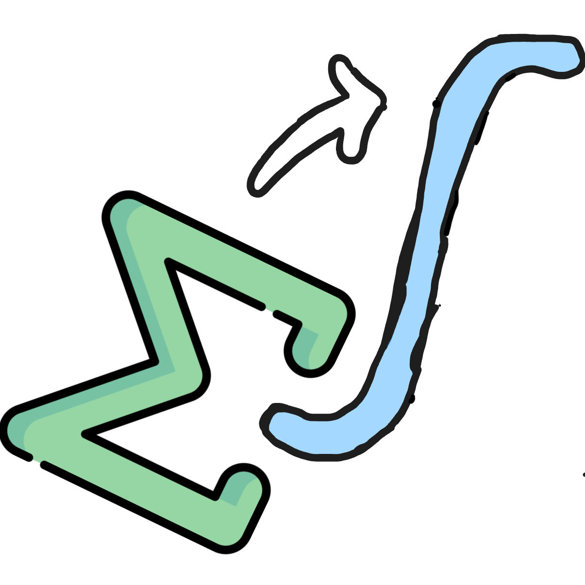

  

  

  

  

  

<h2 align="center">Hi, I'm Maahir Jain 👋</h2>

I’m a junior at $\color{#B3A369}\textbf{Georgia Tech}$, majoring in [computer science](https://www.cc.gatech.edu/). I’m passionate about web development, AI, and mathematics. I also enjoy chess and 3D animation.

Check out [my website](https://maahirjain.github.io) to learn more.

**Feel free to reach out!** 
Email: [maahirdjain@gmail.com](mailto:maahirdjain@gmail.com) 
LinkedIn: [linkedin.com/in/maahirjain](http://linkedin.com/in/maahirjain)

[View my resume](https://maahirjain.github.io/assets/pdfs/Maahir_Jain_Resume.pdf).

  
   

